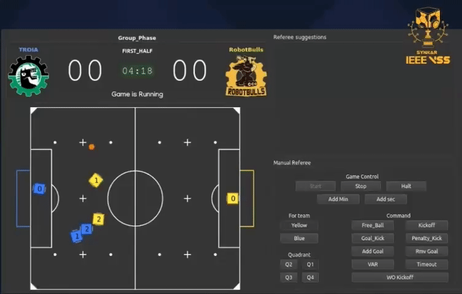

#  Davi Rosim

**`Developer and Researcher`**

>I'm Software Engineering student at National Institute of Telecommunication(Inatel), develeper and competitor for Robotbulls, working in Very Small Size Soccer(VSSS) category.I'm currently developing research related to control and decision-making algorithms based on machine learning and artificial intelligence.

    
    

---

<h2 align="left">VSSS</h2>
              
                     
   IEEE VSSS               |      VSSS FIRASim         | 
:-------------------------:|:-------------------------:|
|       |  
 
 VSSS Referee              | Robotbulls                |   
:-------------------------:|:-------------------------:| 
  |    |

---

<h2 align="left"> Stats</h2>

  <a href="">
  
  

<h4 align='center'>
 
  

<h4 align='center'>
